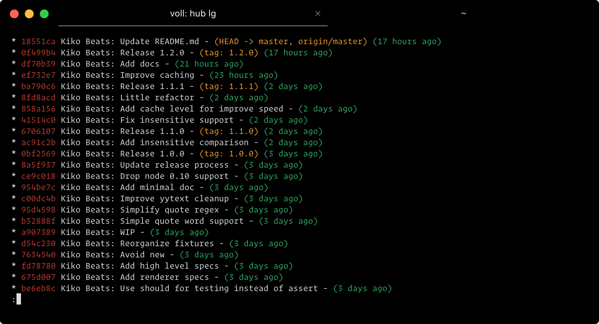

# hyperterm-flat

> Flat [HyperTerm](https://hyperterm.org) theme

## Install

Add `hyperterm-flat` to the plugins list in your `~/.hyperterm.js` config file.

## License

MIT © [Kiko Beats](https://kikobeats.com)
